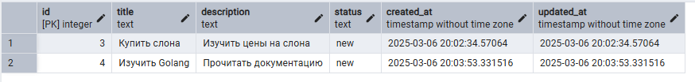

# REST API для управления задачами (TODO-лист)
---

## Используемый стек
- Go + Fiber
- PostgreSQL, pgx
- Docker, Docker-compose
- Swagger

---

## Запуск проекта

Для начала нужно использовать команду для клонирования проекта:

```sh
http://git clone github.com/iswearitrymybest/test-task-skillsrock
```
Далее, весь проект запускается в docker compose:
```sh
docker-compose up --build
```
После чего весь проект развернут на localhost. Для конфигурации проекта используется файл конфигурации .yaml, который по умолчанию называется local.yaml. В нем указаны основные параметры для работы проекта, которые можно конфигурировать. В данной итерации проекта, после изменения файла конфигурации, а именно параметров `storage_dsn` или порта http сервера - нужно будет изменить эти же параметры и в dockerfile

---
## Документация 

В проекте также написана документация для всех эндпоинтов через Swagger, после запуска проекта Swagger можно открыть через:

[http://localhost:9000/swagger/index.html](http://localhost:9000/swagger/index.html)

В нем есть описание всех эндпоинтов и возможность опробовать их

---
## pgadmin
Для удобства взаимодействия с БД вручную (если возникнет такая необходимость), в docker-compose настроен контейнер с pgadmin.
Зайти в него можно по [http://localhost:5050/](http://localhost:5050/). Данные для авторизации заданы в `Dockerfile` в корне проекта

---
## Скриншоты

### POST




---

### GET


---

### DELETE


---

### PUT


